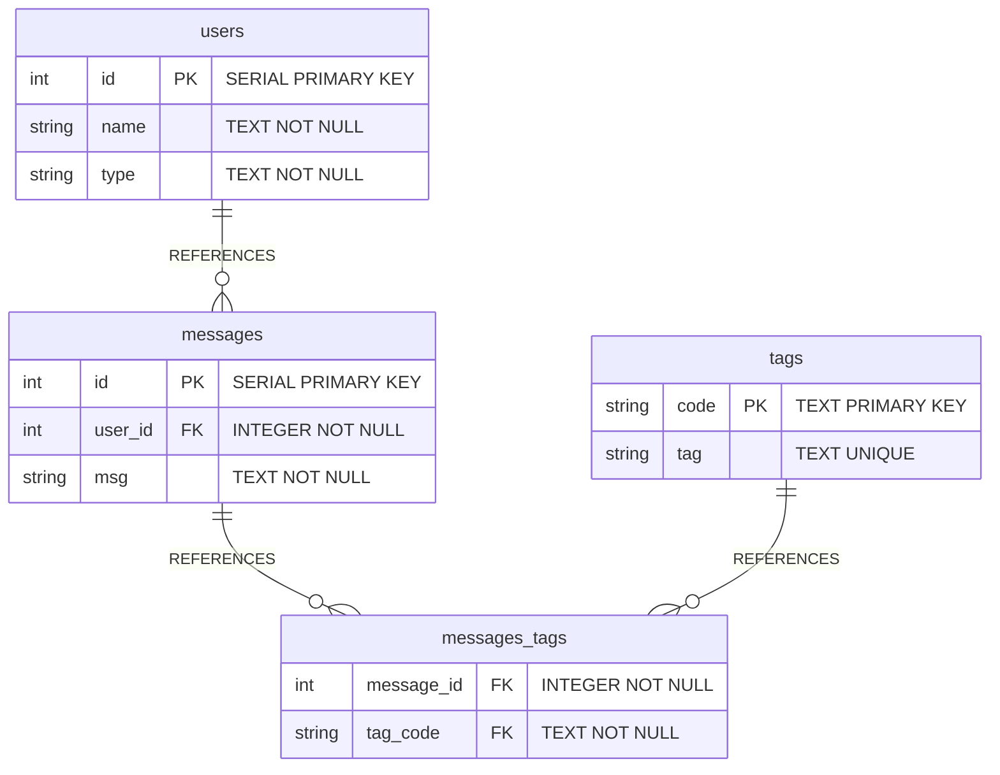

# Steps taken to install this project

## 1. Initial Download

### a. Download the project file from Springboard's website, create a local repository and pushed that code to a new github repository.

## 2. Set up the database

### a. I used the `data.sql` file to set up the database by running the SQL commands in the `data.sql` file against my PostgreSQL instance by first logging into `psql` from my `psql terminal` and creating the database with the command: `CREATE DATABASE pg_relationships_demo;`

### b. Then I exited the `psql` prompt by typing `\q` and pressing the ENTER key.

### c. Then I ran the SQL statements in the `data.sql` file against the newly created database:

`psql pg_relationships_demo < data.sql`

running the command in my terminal: `psql pg_relationships_demo < data.sql`

## 3. Configure the database connection

### a. I chose not to configure this database because I already create a template with a robust database and test-database `sql` files, a `db.js` that uses `.env` variables along with a configured `.gitignore` file. Instead I focused on learning the `psql` syntax for relationship tables and will update my template repository instead of repeating the steps in this project.

## Notes on SQL statements:

### `router.get("/:id", async function (req, res, next) {}` from `messages.js`

This `get` route, defined in `routes/messages.js`, is designed to fetch and return a specific message's details along with any associated tags from a PostgreSQL database. The route is part of an Express application that interacts with a PostgreSQL database using the `pg` module, as configured in `db.js`.

```
router.get("/:id", async function (req, res, next) {
  try {
    const result = await db.query(
          `SELECT m.id, m.msg, t.tag
             FROM messages AS m
               LEFT JOIN messages_tags AS mt
                 ON m.id = mt.message_id
               LEFT JOIN tags AS t ON mt.tag_code = t.code
             WHERE m.id = $1;`,
        [req.params.id]);

    let { id, msg } = result.rows[0];
    let tags = result.rows.map(r => r.tag);

    return res.json({ id, msg, tags });
  }

  catch (err) {
    return next(err);
  }
});
```

#### SQL Syntax Explanation:

```
SELECT m.id, m.msg, t.tag 
FROM messages AS m 
LEFT JOIN messages_tags AS mt 
ON m.id = mt.message_id 
LEFT JOIN tags AS t ON mt.tag_code = t.code 
WHERE m.id = $1;
```

1. `SELECT m.id, m.msg, t.tag ` : The SQL query used in this route performs a `SELECT` operation to fetch the message's ID (`m.id`), message content (`m.msg`), and any associated tags (`t.tag`). It uses a series of `JOIN` operations to combine data from multiple tables.

2. `FROM messages AS m`: This specifies the main table from which the data is being selected. The `messages` table is aliased as `m` for convenience in the query.

3. `LEFT JOIN messages_tags AS mt ON m.id = mt.message_id`: This `LEFT JOIN` operation links the `messages` table to an intermediary table `messages_tags` (aliased as `mt`). The join condition `m.id = mt.message_id` matches each message with its corresponding entries in the `messages_tags` table based on the message's ID. A `LEFT JOIN` is used to ensure that all messages are included in the result set, even if they don't have associated tags.

4. `LEFT JOIN tags AS t ON mt.tag_code = t.code`: Another `LEFT JOIN` operation links the `messages_tags` table to the `tags` table (aliased as `t`). The join condition `mt.tag_code = t.code` matches each entry in the `messages_tags` table with its corresponding tag in the `tags` table based on the tag code. This allows fetching the name of each tag associated with the message.
   
5. `WHERE m.id = $1;`: This `WHERE` clause filters the results to include only the message with the specified ID. `$1` is a placeholder for parameterized queries in PostgreSQL, which helps prevent SQL injection attacks. The value for `$1` is provided by `req.params.id`, which is the message ID extracted from the URL parameter `:id`.

### ERD of `data.sql`

