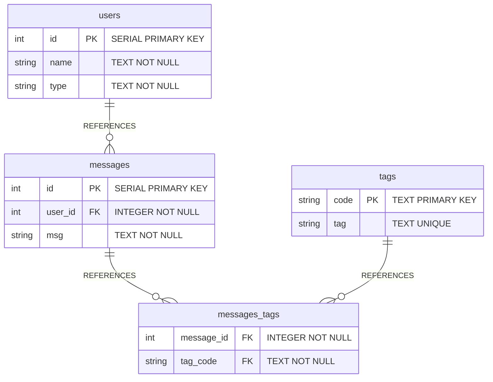
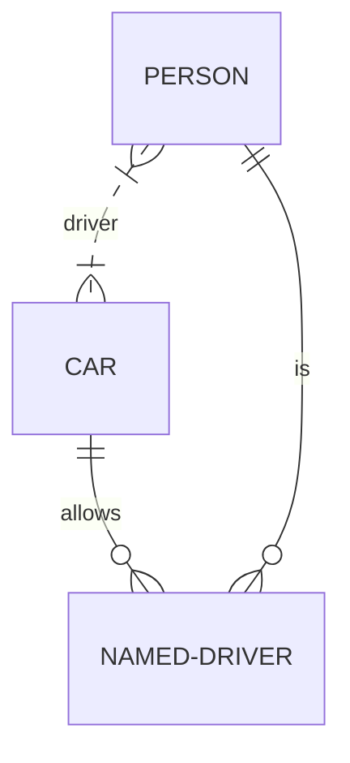
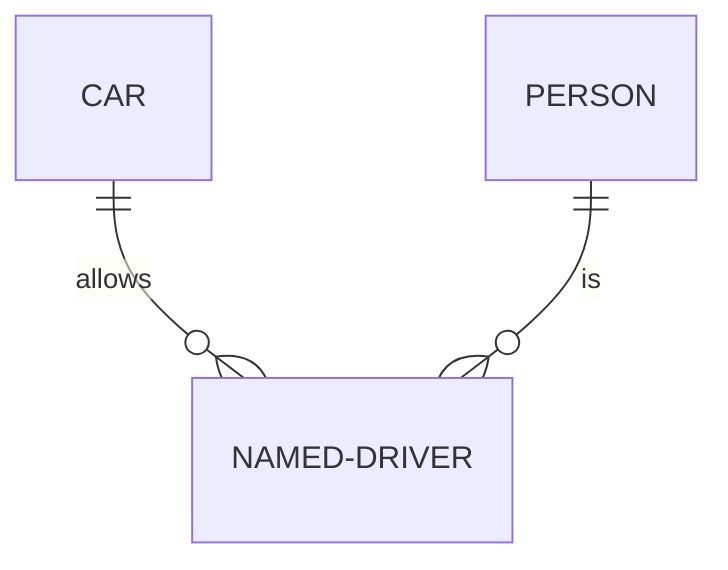
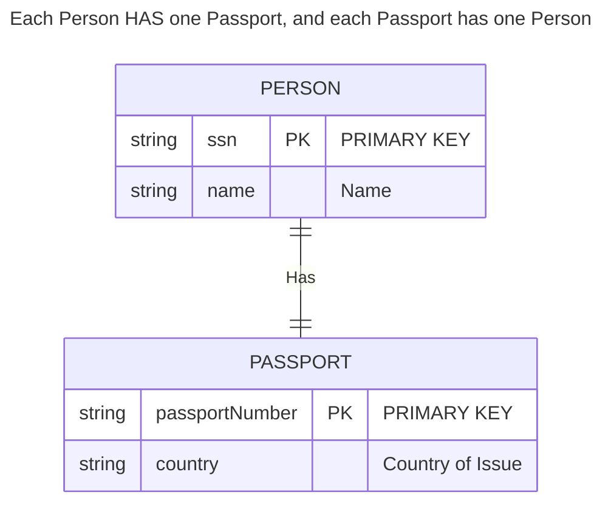
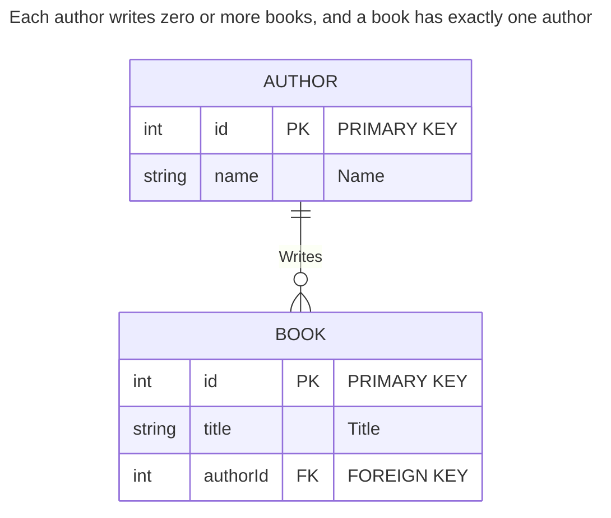
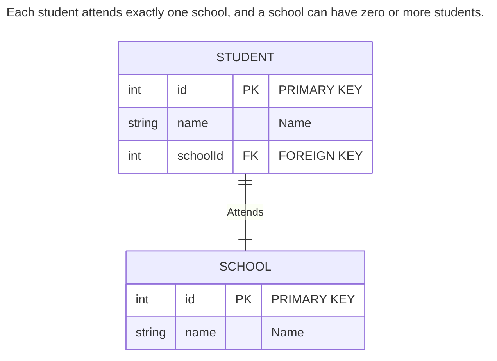
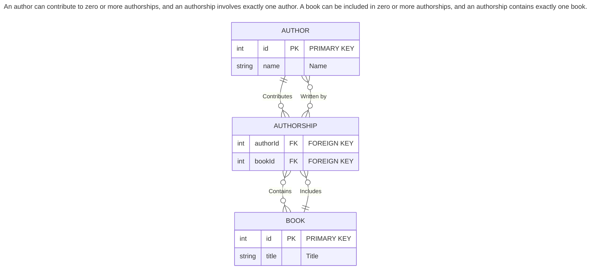

# Steps taken to install this project

## 1. Initial Download

### a. Download the project file from Springboard's website, create a local repository and pushed that code to a new github repository.

## 2. Set up the database

### a. I used the `data.sql` file to set up the database by running the SQL commands in the `data.sql` file against my PostgreSQL instance by first logging into `psql` from my `psql terminal` and creating the database with the command: `CREATE DATABASE pg_relationships_demo;`

### b. Then I exited the `psql` prompt by typing `\q` and pressing the ENTER key.

### c. Then I ran the SQL statements in the `data.sql` file against the newly created database:

`psql pg_relationships_demo < data.sql`

running the command in my terminal: `psql pg_relationships_demo < data.sql`

## 3. Configure the database connection

### a. I chose not to configure this database because I already create a template with a robust database and test-database `sql` files, a `db.js` that uses `.env` variables along with a configured `.gitignore` file. Instead I focused on learning the `psql` syntax for relationship tables and will update my template repository instead of repeating the steps in this project.

## Notes on SQL statements:

### `router.get("/:id", async function (req, res, next) {}` from `messages.js`

This `get` route, defined in `routes/messages.js`, is designed to fetch and return a specific message's details along with any associated tags from a PostgreSQL database. The route is part of an Express application that interacts with a PostgreSQL database using the `pg` module, as configured in `db.js`.

```
router.get("/:id", async function (req, res, next) {
  try {
    const result = await db.query(
          `SELECT m.id, m.msg, t.tag
             FROM messages AS m
               LEFT JOIN messages_tags AS mt
                 ON m.id = mt.message_id
               LEFT JOIN tags AS t ON mt.tag_code = t.code
             WHERE m.id = $1;`,
        [req.params.id]);

    let { id, msg } = result.rows[0];
    let tags = result.rows.map(r => r.tag);

    return res.json({ id, msg, tags });
  }

  catch (err) {
    return next(err);
  }
});
```

#### SQL Syntax Explanation:

```
SELECT m.id, m.msg, t.tag
FROM messages AS m
LEFT JOIN messages_tags AS mt
ON m.id = mt.message_id
LEFT JOIN tags AS t ON mt.tag_code = t.code
WHERE m.id = $1;
```

1. `SELECT m.id, m.msg, t.tag ` : The SQL query used in this route performs a `SELECT` operation to fetch the message's ID (`m.id`), message content (`m.msg`), and any associated tags (`t.tag`). It uses a series of `JOIN` operations to combine data from multiple tables.

2. `FROM messages AS m`: This specifies the main table from which the data is being selected. The `messages` table is aliased as `m` for convenience in the query.

3. `LEFT JOIN messages_tags AS mt ON m.id = mt.message_id`: This `LEFT JOIN` operation links the `messages` table to an intermediary table `messages_tags` (aliased as `mt`). The join condition `m.id = mt.message_id` matches each message with its corresponding entries in the `messages_tags` table based on the message's ID. A `LEFT JOIN` is used to ensure that all messages are included in the result set, even if they don't have associated tags.

4. `LEFT JOIN tags AS t ON mt.tag_code = t.code`: Another `LEFT JOIN` operation links the `messages_tags` table to the `tags` table (aliased as `t`). The join condition `mt.tag_code = t.code` matches each entry in the `messages_tags` table with its corresponding tag in the `tags` table based on the tag code. This allows fetching the name of each tag associated with the message.
5. `WHERE m.id = $1;`: This `WHERE` clause filters the results to include only the message with the specified ID. `$1` is a placeholder for parameterized queries in PostgreSQL, which helps prevent SQL injection attacks. The value for `$1` is provided by `req.params.id`, which is the message ID extracted from the URL parameter `:id`.

### ERD of `data.sql`



### explanation of `Mermaid` syntax used to generate diagram above

[mermaid.js syntax guide](https://mermaid.js.org/syntax/entityRelationshipDiagram.html#relationship-syntax)

#### full `mermaid` code:

```
erDiagram
    users {
        int id PK "SERIAL PRIMARY KEY"
        string name "TEXT NOT NULL"
        string type "TEXT NOT NULL"
    }
    messages {
        int id PK "SERIAL PRIMARY KEY"
        int user_id FK "INTEGER NOT NULL"
        string msg "TEXT NOT NULL"
    }
    tags {
        string code PK "TEXT PRIMARY KEY"
        string tag "TEXT UNIQUE"
    }
    messages_tags {
        int message_id FK "INTEGER NOT NULL"
        string tag_code FK "TEXT NOT NULL"
    }

    users ||--o{ messages : "REFERENCES"
    messages ||--o{ messages_tags : "REFERENCES"
    tags ||--o{ messages_tags : "REFERENCES"
```

#### line by line explanation

1. ##### `erDiagram`:

   Declares the start of an ER diagram.

2. ##### `users` table

```
users {
    int id PK "SERIAL PRIMARY KEY"
    string name "TEXT NOT NULL"
    string type "TEXT NOT NULL"
}
```

Defines the `users` table with three columns: `id` (an integer primary key marked with `PK` and defined as a `SERIAL PRIMARY KEY` in SQL), `name` (a string that cannot be null, `TEXT NOT NULL`), and `type` (also a non-nullable string, `TEXT NOT NULL`).

3. ##### `messages` table

```
messages {
    int id PK "SERIAL PRIMARY KEY"
    int user_id FK "INTEGER NOT NULL"
    string msg "TEXT NOT NULL"
}
```

Defines the `messages` table with three columns: `id` (an integer primary key), `user_id` (an integer foreign key marked with `FK`, `INTEGER NOT NULL`, referencing the `users` table), and `msg` (a non-nullable text column, `TEXT NOT NULL`).

4. ##### `messages_tags` table

```
messages_tags {
    int message_id FK "INTEGER NOT NULL"
    string tag_code FK "TEXT NOT NULL"
}
```

Defines the `messages_tags` table, which is a junction table for a **many-to-many** relationship between `messages` and `tags`. It has two columns: `message_id` (an integer foreign key, `INTEGER NOT NULL`, referencing `messages`) and `tag_code` (a text foreign key, `TEXT NOT NULL`, referencing `tags`).

**NB** --> side note about "relationship symbols" which indicate the nature of the relationship between the data tables in the diagram. Below is a list of the syntax that creates these symbols.

- `||` represents a "one" side of a relationship.
- `o{` represents the "many" side of a relationship.

So, for example, the syntax `users ||--o{ messages : "REFERENCES"` represents a **one-to-many** relationship from `users` to `messages`, indicating that one user can have zero or many messages, but each message is associated with exactly one user.

5. ##### `users ||--o{ messages : "REFERENCES"`

   Represents a **one-to-many** relationship from `users` to `messages`. A user can have zero or many messages, but each message is associated with exactly one user.

6. ##### `messages ||--o{ messages_tags : "REFERENCES"`

   Represents a **one-to-many** relationship from `messages` to `messages_tags`. A message can have zero or many tags through the `messages_tags` junction table.

7. ##### `tags ||--o{ messages_tags : "REFERENCES"`
   Represents a **one-to-many** relationship from `tags` to `messages_tags`. A tag can be associated with zero or many messages through the `messages_tags` junction table.

### Relationship Syntax Legend

#### 1. **Zero or one**:

- when the value is on the LEFT: `|o`
- when the value is on the RIGHT: `o|`

#### 2. **Exactly one**:

- when the value is on the LEFT: `||`
- when the value is on the RIGHT: `||`

#### 3. **Zero or more (no upper limit)**:

- when the value is on the LEFT: `}o`
- when the value is on the RIGHT: `o{`

#### 4. **One or more (no upper limit)**:

- when the value is on the LEFT: `}|`
- when the value is on the RIGHT: `|{`

### Alias

| Value (left) | Value (right) | Alias for    |
| ------------ | ------------- | ------------ |
| one or zero  | one or zero   | Zero or one  |
| zero or one  | zero or one   | Zero or one  |
| one or more  | one or more   | One or more  |
| one or many  | one or many   | One or more  |
| many(1)      | many(1)       | One or more  |
| 1+           | 1+            | One or more  |
| zero or more | zero or more  | Zero or more |
| zero or many | zero or many  | Zero or more |
| many(0)      | many(1)       | Zero or more |
| 0+           | 0+            | Zero or more |
| only one     | only one      | Exactly one  |
| 1            | 1             | Exactly one  |

### Identification

Relationships may be classified as either identifying or non-identifying and these are rendered with either solid or dashed lines respectively. This is relevant when one of the entities in question can not have independent existence without the other. For example a firm that insures people to drive cars might need to store data on `NAMED-DRIVER`s. In modelling this we might start out by observing that a `CAR` can be driven by many `PERSON` instances, and a `PERSON` can drive many `CAR`s - both entities can exist without the other, so this is a non-identifying relationship that we might specify in Mermaid as: `PERSON }|..|{ CAR : "driver"`. Note the two dots in the middle of the relationship that will result in a dashed line being drawn between the two entities. But when this many-to-many relationship is resolved into two one-to-many relationships, we observe that a `NAMED-DRIVER` cannot exist without both a `PERSON` and a `CAR` - the relationships become identifying and would be specified using hyphens, which translate to a solid line:

both entities can exist without the other, so this is a non-identifying relationship that we might specify in Mermaid as: 
```
PERSON }|..|{ CAR : "driver"
```



But when this many-to-many relationship is resolved into two one-to-many relationships, we observe that a `NAMED-DRIVER` cannot exist without both a `PERSON` and a `CAR` - the relationships become identifying and would be specified using hyphens, which translate to a solid line and so we can ommit `PERSON }|..|{ CAR : "driver"` from the diagram below.



### More examples of `mermaid` syntax that defines each type of relationship

#### One-to-One Relationship

In a one-to-one relationship, each row in Table A is linked to at most one row in Table B, and vice versa. This is represented in Mermaid syntax as `||--||`.

##### `mermaid` syntax:

```
erDiagram
    PERSON {
        string ssn PK "PRIMARY KEY"
        string name "Name"
    }
    PASSPORT {
        string passportNumber PK "PRIMARY KEY"
        string country "Country of Issue"
    }
    PERSON ||--|| PASSPORT : "Has"
```

##### diagram:



#### One-to-Many Relationship

In a one-to-many relationship, each row in Table A can be linked to many rows in Table B, but each row in Table B is linked to at most one row in Table A. This is represented in Mermaid syntax as `||--o{`.

##### `mermaid` syntax:

```
erDiagram
    AUTHOR {
        int id PK "PRIMARY KEY"
        string name "Name"
    }
    BOOK {
        int id PK "PRIMARY KEY"
        string title "Title"
        int authorId FK "FOREIGN KEY"
    }
    AUTHOR ||--o{ BOOK : "Writes"
```

##### diagram:



#### Many-to-One Relationship

A many-to-one relationship is essentially the inverse of a one-to-many relationship, where many rows in Table A are linked to one row in Table B. This can also be represented as `||--o{`, depending on the direction you are illustrating the relationship from.

##### `mermaid` syntax:

```
erDiagram
    STUDENT {
        int id PK "PRIMARY KEY"
        string name "Name"
        int schoolId FK "FOREIGN KEY"
    }
    SCHOOL {
        int id PK "PRIMARY KEY"
        string name "Name"
    }
    STUDENT ||--o{ SCHOOL : "Attends"
```

##### diagram:



#### Many-to-Many Relationship

In a many-to-many relationship, rows in Table A can be linked to many rows in Table B, and vice versa. This is often represented through a junction table. In Mermaid syntax, this is represented as `o{--}o`.  Also, the diagram below can be summarized in the following statement: "An author can contribute to zero or more authorships, and an authorship involves exactly one author. A book can be included in zero or more authorships, and an authorship contains exactly one book. This setup allows for a many-to-many relationship between authors and books, mediated by the authorship entity."

##### `mermaid` syntax:

```
erDiagram
    AUTHOR {
        int id PK "PRIMARY KEY"
        string name "Name"
    }
    BOOK {
        int id PK "PRIMARY KEY"
        string title "Title"
    }
    AUTHORSHIP {
        int authorId FK "FOREIGN KEY"
        int bookId FK "FOREIGN KEY"
    }
    AUTHOR ||--o{ AUTHORSHIP : "Contributes"
    BOOK ||--o{ AUTHORSHIP : "Includes"
    AUTHORSHIP }o--o{ AUTHOR : "Written by"
    AUTHORSHIP }o--o{ BOOK : "Contains"
```

##### diagram:


